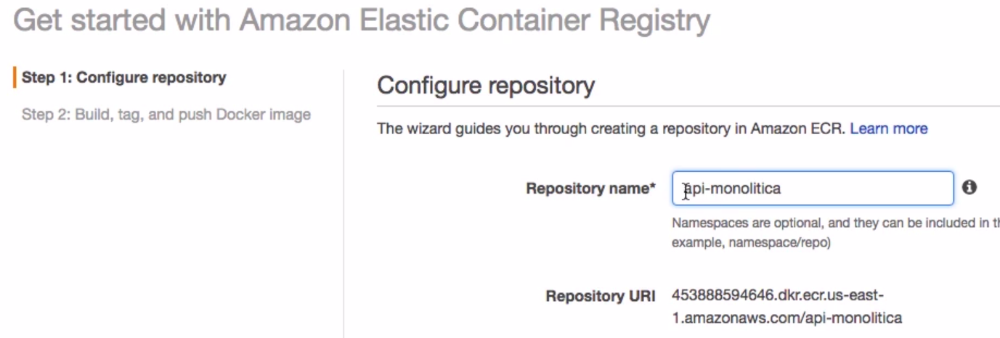
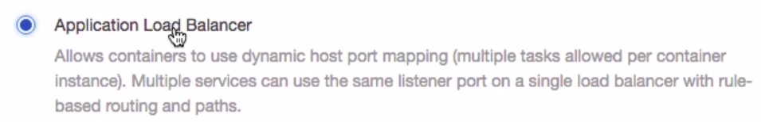
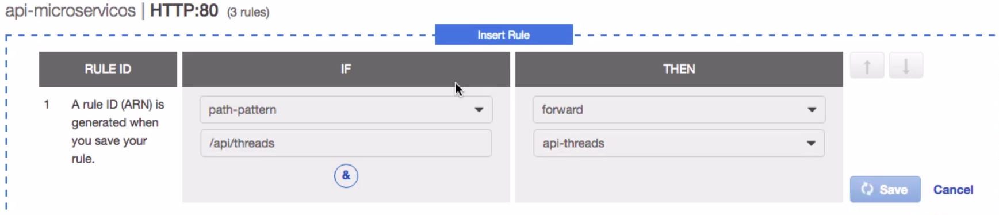

<h1>Treinamento AWS:.</h1>

<h2>Pilares:</h2>
<p>
Segurança. <br>
Eficiência de performance.<br>
Confiabilidade.<br>
Excelência operacional.<br>
Otimização de custos.
</p>

<h2>É indicado fazer dupla autenticação.</h2>

<br>

<h2>URLS:</h2>
<p>
https://aws.amazon.com/pt/console/<br>
https://console.aws.amazon.com<br>
https://github.com/cassianobrexbit/dio-live-coding-aws<br>
https://calculator.aws <- Faz as estimativas de preço<br>
https://www.freenom.com/pt/index.html<br>
https://docs.aws.amazon.com/cli/latest/userguide/getting-started-install.html<br>
</p>

<h2>Significados:</h2>
<p>
RDS: Banco de dados relacional.<br>
DynamoDB: NoSQL.<br>
EC2: Elastic computer - maquina virtual.<br>
S3: Armazenamento de arquivos.<br>
Cognito: Poll de usuários, garantindo as permissões, rules, validação de emails entre outras coisas.<br>
API Gateway: HTTP Api (Mais simples) - Criar as rotas - Ele cria o endpoint para acessar a Lambda Function.<br>
Route: API_GATWEWAY/items (post/get) - Cadastrar os 2 lá e integrar com a Lambda Function.<br>
EBS - Disco rígido na AWS.<br>
VPC - Rede virtual da AWS.<br>
ECR - Elastic Container Registry (Repositório Privado)<br>
CloudShell - Maquina virtual linux para interagir com o ambiente AWS<br>
# aws s3 ls <br>
</p>

<h2>Security Group: A maquina está na AWS, ele é o firewall.</h2>

<p>

<br>
Key pair: Da acesso a maquina virtual, não perder o arquivo aws-gus.pem<br>
Add a rule HTTP -> 0.0.0.0/0, ::/0<br>


</p>

<h2>Lambda Functions:</h2>
<p>
- Cria pequenas funções com node.<br>
- Pode ser container e codigo zip.<br>
- Selecionei - Basic Info - Scratch - Node.js - Create function - Vai gravar no DynamoDB, verificar o arquivo index.js.<br> 
</p>

<h2>Mão na massa:</h2>
<p>
Criarei um EC2 (img.png)<br>

<br>
A maquina virtual e disco são cobrados separados.<br>
</p>

x<h2>Acessar a EC2:</h2>
<p>
Selecionar ela no console e depois conectar e selecionar Cliente SSH<br>

<br>

Copiar a chave para esse diretorio e rodar o comando abaixo<br>
`chmod 400 aws-gus.pem` (Mudar o acesso de leitura)<br>
`ssh -i "aws-gus.pem" ec2-user@ec2-34-229-142-62.compute-1.amazonaws.com`<br>
</p>

<br>

<h2>É indicado proteger contra encerramento.</h2>

<br>

<h2>Criar script de inicialização EC2.</h2>

<p>
Advanced Details:<br>

<br>

````
#!/bin/bash                                                   <- Provisionar o ambiente
yum update -y                                                 <- Faz o update e responde y para continuar
amazon-linux-extras install -y lamp-mariadb10.2-php7.2 php7.2 <- Add esses repositórios
yum install -y httpd mariadb-server                           <- Install apache e MySQL
yum install -y php7.2
systemctl start httpd                                         <- Start apache
systemctl enable httpd                                        <- Inicia automatico quando reiniciar
systemctl start mariadb                                       <- Start apache
systemctl enable mariadb                                      <- Inicia automatico quando reiniciar
usermod -a -G apache ec2-user                                 <- Alterar permissões Apache
chown -R ec2-user:apache /var/www
````

`netstat -ltun <- Verificar se o que está rodando (Entrar via ssh)` <br><br>


Verificando se deu certo (Ele abre a pagina inicial do Apache) -> Public IPv4 address -> 35.175.186.61 <br>
 <br>

Criando uma imagem a partir dessa instancia: image and templates - create image - create image<br>
Verificar em: Images - AMIs<br>
 <br>
Agora podemos criar um EC2 dessa imagem.<br>
<br>
</p>

<h2>Liberar comunicação entre duas EC2.</h2>
<p>
Change security groups - Verificar que só tem o de acesso remoto por enquanto. <br>

<br>
O grupo default é criado com o EC2 para comunicaçao interna. <br>
Adicionar o default nos dois EC2. <br>
<br>
Agora eles conseguem se comunicar.<br>
<br>
</p>

<h2>Atribuir IP Fixo EC2.</h2>
<p>
Network & Security - Elastic IPs <br>
Pode associar a 1 instancia sem cobrar, SE A INSTANCIA ESTIVER STOP SERÁ COBRADO.<br>

<br>
Agora precisa associar so EC2 que deseja.<br>

</p>

<h2>RDS.</h2>
<p>
Create database - Standard create - MySQL - MySQL 5.7.22 - Free tier - Create database <br>
Acessei o EC2 web-dev2 e dele eu consigo acessar o MySQL - g*****2 <br>
</p>

````
mysql -u admin -h database-1.cgsaefhkgnsu.us-east-1.rds.amazonaws.com -p
show databases;
create database cadastro;
````

<h2>EC2 apontando para o RDS:</h2>

````
sudo systemctl stop mariadb                                   <- Parar
sudo systemctl disable mariadb                                <- Remover o auto start
cd /var/www/
mkdir cadastro
cd cadastro/
vi dbinfo.cadastro      <- Verificar o arquivo cadastro/dbinfo.cadastro
cd ../html/
vi index.php            <- Verificar o arquivo cadastro/index.php
Vai subir o projeto abaixo já apontando para o RDS com ajuda do PHP.
sudo shutdown -h now    <- Parar linux
````


<h2>Escalando</h2>
<p>
O usuário chega na AWS pela 80 ou 443 e o load balance distribui. <br>
Você pode gerenciar pela porta 22. <br>

<br>

Load Balancing - Load Balancers - Create Load Balancer - Http/Https<br>
Selecionar no mínimo duas -><br>
<br>
<br>
Deixar a imagem sem preencher por enquanto, ela será preenchida pelo serviço que escala.
<br>
Auto Scaling - Launch Configurations - Create - Selecionar a AMIs<br>
<br>
<br>
<br>
<br>
<br>
<br>
<br>
<br>
<br>
<br>
Se eu terminar um EC2 ele cria outro automaticamente. <br>
</p>

<h2>Gerenciar ambiente</h2>

````
curl "https://awscli.amazonaws.com/awscli-exe-linux-x86_64.zip" -o "awscliv2.zip"
unzip awscliv2.zip
sudo ./aws/install
aws --version
aws configure
aws ec2 help
aws ec2 describe-instances | more
aws ec2 describe-instances --instance-id id-da-instancia
aws ec2 start-instances --instance-ids i-idddddadas
aws ec2 stop-instances --instance-ids i-idddddadas
````

<p>
Criar usuário para o terminal.<br>

<br>
<br>
<br>
<br>
<br>
<br>
</p>

<h2>Amazon Lightsail (Digital Ocean é parecido), configura mais fácil os serviços</h2>
<p>
Ele monta e sobe muito rápido o ambiente<br>
A porta 22 é do acesso ssh<br>

<br>
Tem muitas imagens prontas<br>
<br>
<br>
Acessando pelo terminal<br>
<br>
chmod u+x wp1.sh <- Permissão para executar<br>
<br>
<br>
É possível criar uma nova instância a partir de um snapshot.<br>
Através deste recurso você tem um processo de recover bem simples, bastando apenas criar uma nova instância baseada em
seu snapshot.<br>
</p>

<h2>Cloud Watch: Monitorar EC2 e aplicações</h2>
<p>
Concentra eventos em lote<br>
Podemos criar gráficos e ações por ele<br>
Mostra quanto vai pagar abaixo:<br>

<br>
Criar alarme de custo<br>
<br>
<br>
Ciar um S3 para o exemplo:<br>
<br>
Subi as imagens da pasta cloudwatch-site/imagens<br>
<br>
Criei o EC2 agora<br>
<br>
Configurando o EC2 <br>

````
sudo apt-get update -y
sudo apt-get install apache2 -y
sudo groupadd www                   <- Cria o grupo www
sudo usermod -a -G www ubuntu       <- Coloca o usuario ubuntu no grupo www
sudo chown -R root:www /var/www     <- Muda as permissões do diretorio
sudo chmod -R 777 /var/www/html     <- Dar permissão de escrita e leitura
cd /var/www/html
copiar os arquivos da pasta /cloudwatch-site/html com o filezilla
````

Para acessar as imagens public<br>
<br>

````
{
    "Version": "2012-10-17",
    "Statement": [
        {
        "Sid": "AddPerm",
        "Effect": "Allow",
        "Principal": "*",
        "Action": "s3:GetObject",
        "Resource": "arn:aws:s3:::gcdsilv/imagens/*"
        }
    ]
}
````

Testando a URL: https://gcdsilv.s3.amazonaws.com/imagens/1.jpg <br>
Conectando com o Filezilla<br>
<br>
<br>
Agora o EC2 aponta para as imagens que estão no S3.<br>
<br>
Testando<br>

````
sudo apt-get install stress-ng
````

Rodando o teste durante 5 minutos dentro do EC2<br>
<br>
Criar alarme EC2 CPU Utilization:<br>
<br>
<br>
<br>
Tem como receber por SMS<br>
<br>
<br>
Alarme quando a imagem parar<br>
<br>
<br>
<br>
Logs:<br>
<br>
Criar um usuário para enviar os logs para o Cloud Watch<br>
<br>

````
{
  "Version": "2012-10-17",
  "Statement": [
    {
      "Effect": "Allow",
      "Action": [
        "logs:CreateLogGroup",
        "logs:CreateLogStream",
        "logs:PutLogEvents",
        "logs:DescribeLogStreams"
    ],
      "Resource": [
        "arn:aws:logs:*:*:*"
    ]
  }
 ]
}
````

<br>
<br>
<br>
Verificar caso precise no futuro<br>
<br>
<br>
AWS Lambda, roda o script de tempos em tempos.<br>
<br>
<br>
<br>
<br>
Enviando email no caso de erro para o tópico<br>
<br>
Add police para enviar SNS<br>
<br>
<br>
<br>

````
from botocore.vendored import requests
import boto3

client = boto3.client('sns')

site = 'URL DO SITE'
web_hook = 'URL WEB_HOOK'
mensagem = {'text': '=====Houston, we have a problem!====='}

def lambda_handler(event, context):
    try:
       requests.get(site, timeout=5)
       print('Site OK!')
   except Exception:
       print('Houston, we have a problem!')
       envia_notificacao()

def envia_notificacao():
   client.publish(
       TopicArn='ARN DO TÓPICO',
       Message='Houston, we have a problem!',
       Subject='ALERTA')
````

<br>
</p>

<h2>Elastic Container Service (Amazon ECS)</h2>
<p>
4 camadas: <br>
- Container <br>
- Task: Parâmetros para a imagem rodar <br> 
- Service: Administra as tarefas <br>
- Cluster: Agrupamento de instancias<br>

<br>
Ele configura/gerencia automaticamente a infra<br>
Fargate - Paga por tarefa, no EC2 tem mais flexibilidade<br>
<br>
<br>
<br>
<br>
Para terminar o serviço não pode ter task<br>
<br>
<br>
</p>

<h2>Criar cluster EC2</h2>
<p>

<br>
<br>
<br>
<br>
<br>
<br>
Ele criou as 2 instancias EC2<br>
<br>
Se uma terminar ele já cria outra<br>
<br>
</p>

<h2>Subindo aplicação monolitica EC2</h2>
<p>

<br>
https://hub.docker.com/r/rmerces/api-monolitica <br>

````
docker pull rmerces/api-monolitica
docker run --name api-mono -d -p 3000:3000 rmerces/api-monolitica
docker ps
http://localhost:3000/api/
http://localhost:3000/api/users
http://localhost:3000/api/threads
http://localhost:3000/api/posts
http://localhost:3000/api/users/2
http://localhost:3000/api/threads/3
http://localhost:3000/api/posts/in-thread/1
http://localhost:3000/api/posts/by-user/2
````

ECR - Elastic Container Registry (Repositório Privado)
<br>
<br>
<br>
<br>
Manter as 2 ultimas imagens<br>
<br>
<br>
Vamos criar a task para a nossa imagem<br>
<br>
<br>
<br>
<br>
<br>
<br>
<br>
Dar acesso ao container<br>
<br>
Criando o cluster<br>
<br>
<br>
<br>
Criar load balance<br>
<br>
<br>
<br>
<br>
<br>
<br>
Acessar o container (acesso interno)
<br>
Deixando mais especifico<br>
<br>
<br>
</p>

<h2>Subindo aplicação em Microserviços</h2>
<p>
De acordo com o path ele muda o target Group<br>

<br>
<br>
<br>
Cria paras as 3, igual o exemplo anterior.
<br>
<br>
Criar load balancer<br>
<br>
<br>
<br>
<br>
Criar os 3 target groups<br>
<br>
Editar resgras LB<br>
<br>
<br>
<br>
<br>
<br>
Agora é só criar o serviço<br>
<br>
<br>
<br>
<br>
<br>
Pegar o Ip Publico<br>
<br>
</p>
